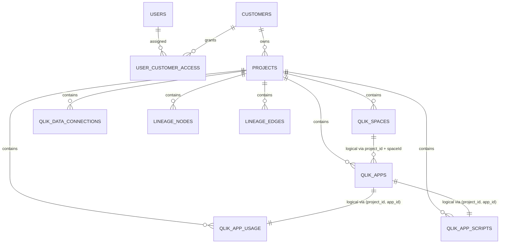

# DB Model (Current Schema Overview)

## Purpose

- Uebersicht ueber das aktuelle PostgreSQL-Datenmodell von `qlik_atlas`.
- Zeigt PK/FK-Beziehungen und wichtige fachliche (nicht als FK modellierte) Joins.

## Sources (Code-First)

- Primar: `backend/app/models.py`
- Migrationen/Policies: `backend/alembic/versions/0006_user_customer_access_and_rls.py`, `backend/alembic/versions/0007_db_runtime_source_tables.py` sowie spaetere Erweiterungs-Migrationen (`0009` bis `0012`)

## Important Note

- Diese Doku ist eine abgeleitete Schema-Uebersicht aus Code/Migrationen, nicht ein Live-DB-Dump.
- Einige Beziehungen sind bewusst nur fachlich modelliert (z. B. Qlik-IDs in `JSONB`/payload-nahen Feldern) und nicht als PostgreSQL-FK erzwungen.

## Table Overview

| Table | Primary Key | Foreign Keys | Zweck |
|---|---|---|---|
| `users` | `id` | - | Login/Authentifizierung |
| `customers` | `id` | - | Kunden/Tenants mit verschluesselten Qlik-Credentials |
| `projects` | `id` | `customer_id -> customers.id` | Projekt-Scope fuer alle Qlik-/Lineage-Daten |
| `user_customer_access` | `(user_id, customer_id)` | `user_id -> users.id`, `customer_id -> customers.id` | Kundenzugriff fuer Nicht-Admins |
| `qlik_apps` | `(project_id, app_id)` | `project_id -> projects.id` | Qlik-App-Metadaten (JSONB + materialisierte Spalten) |
| `qlik_spaces` | `(project_id, space_id)` | `project_id -> projects.id` | Qlik-Space-Metadaten (JSONB + materialisierte Spalten) |
| `qlik_data_connections` | `(project_id, connection_id)` | `project_id -> projects.id` | Qlik Data Connections (JSONB + materialisierte Spalten) |
| `qlik_app_usage` | `(project_id, app_id)` | `project_id -> projects.id` | App-Usage-Aggregate (JSONB + materialisierte Spalten) |
| `qlik_app_scripts` | `(project_id, app_id)` | `project_id -> projects.id` | App-Skripte |
| `lineage_nodes` | `(project_id, node_id)` | `project_id -> projects.id` | Graph-Nodes |
| `lineage_edges` | `(project_id, edge_id)` | `project_id -> projects.id` | Graph-Edges |

## Key Design Pattern

- Fast alle fachlichen Daten sind `project_id`-scoped.
- Viele Tabellen behalten `data JSONB` als Roh-/Kompatibilitaetsfeld.
- Wichtige UI-/Join-relevante Werte werden zunehmend als eigene Spalten materialisiert.

## Materialized Payload Columns (Examples)

### `qlik_apps`

- Payload-Spalten fuer UI/Filter/Runtime-Reads:
- `appName`, `spaceId`, `status`, `fileName`, `nodesCount`, `edgesCount`, `rootNodeId`, `lineageFetched`, `lineageSuccess`
- `data` bleibt weiterhin erhalten

### `qlik_spaces`

- Payload-Spalten fuer UI/Joins:
- `spaceName`, `spaceId`, `ownerId`, `tenantId`, `type`, `createdAt`, `updatedAt`
- `data` bleibt weiterhin erhalten

### `qlik_app_usage`

- Payload-Spalten fuer Runtime-Reads:
- `appName`, `windowDays`, `generatedAt`, `_artifactFileName`
- Flattened Usage-Felder wie `usageReloads`, `usageAppOpens`, `usageSheetViews`, `usageUniqueUsers`, `usageLastReloadAt`, `usageLastViewedAt`, `usageClassification`
- `connections` als `JSONB`
- `data` bleibt weiterhin erhalten

### `qlik_data_connections`

- Payload-Spalten fuer Runtime-Reads/Filter:
- `id`, `qID`, `qri`, `tags`, `user`, `links`, `qName`, `qType`, `space`, `qLogOn`, `tenant`, `created`, `updated`, `version`, `privileges`, `datasourceID`, `qArchitecture`, `qCredentialsID`, `qEngineObjectID`, `qConnectStatement`, `qSeparateCredentials`
- `data` bleibt weiterhin erhalten

## Physical FK Relationships (Enforced by DB)

- `projects.customer_id -> customers.id`
- `user_customer_access.user_id -> users.id`
- `user_customer_access.customer_id -> customers.id`
- `qlik_apps.project_id -> projects.id`
- `qlik_spaces.project_id -> projects.id`
- `qlik_data_connections.project_id -> projects.id`
- `qlik_app_usage.project_id -> projects.id`
- `qlik_app_scripts.project_id -> projects.id`
- `lineage_nodes.project_id -> projects.id`
- `lineage_edges.project_id -> projects.id`

## Logical Relationships (Not DB-FK Enforced)

- `qlik_apps` <-> `qlik_spaces`
- Join ueber `project_id` + App-Space-Key:
- bevorzugt `qlik_apps.spaceId` (materialisiert) mit `qlik_spaces.spaceId` (materialisiert)
- Fallback in Bestandsdaten: `qlik_apps.space_id` mit `qlik_spaces.space_id`

- `qlik_app_usage` <-> `qlik_apps`
- Join ueber `project_id` + `app_id` (gleiche Composite-Key-Form, aber kein FK auf `qlik_apps`)

- `qlik_app_scripts` <-> `qlik_apps`
- Join ueber `project_id` + `app_id` (fachlich eindeutig, nicht als FK modelliert)

- `lineage_nodes` / `lineage_edges` <-> `qlik_apps`
- App-Bezug laeuft teils ueber `app_id`-Spalten, teils ueber Metadaten/Payload IDs (z. B. Qlik-QRI-Format vs UUID)
- Backend-Runtime-Reads normalisieren diese IDs fuer UI-Anreicherung

## Mermaid ERD (High-Level)

## RLS / Access Notes

- RLS ist ein zentraler Bestandteil des Datenmodells fuer projekt-/kundenbezogene Sichtbarkeit.
- Relevante Tabellen wurden ueber Migrationen mit Policies versehen (u. a. `customers`, `projects`, `qlik_apps`, `lineage_nodes`, `lineage_edges` sowie Runtime-Tabellen aus `0007`).
- Fuer UI/Runtime-Reads ist deshalb nicht nur das Schema, sondern auch der gesetzte DB-Context (User/Rolle) relevant.

## Where To Inspect Live Schema (Without Data)

- `pgAdmin` (Service im `docker-compose.yml`)
- `information_schema.columns`
- `psql \d+ <table>`
