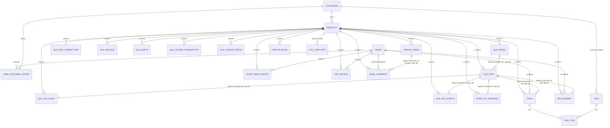

# DB Model (Current Schema Overview)

## Purpose

- Uebersicht ueber das aktuelle PostgreSQL-Datenmodell von `qlik_atlas`.
- Zeigt PK/FK-Beziehungen und wichtige fachliche (nicht als FK modellierte) Joins.

## Sources (Code-First)

- Primar: `backend/app/models.py`
- Migrationen/Policies: `backend/alembic/versions/0006_user_customer_access_and_rls.py`, `backend/alembic/versions/0007_db_runtime_source_tables.py` sowie spaetere Erweiterungs-Migrationen (`0009` bis `0012`, `0019`, `0020`, `0021`)

## Important Note

- Diese Doku ist eine abgeleitete Schema-Uebersicht aus Code/Migrationen, nicht ein Live-DB-Dump.
- Einige Beziehungen sind bewusst nur fachlich modelliert (z. B. Qlik-IDs in `JSONB`/payload-nahen Feldern) und nicht als PostgreSQL-FK erzwungen.

## Table Overview

| Table | Primary Key | Foreign Keys | Zweck |
|---|---|---|---|
| `users` | `id` | - | Login/Authentifizierung |
| `refresh_tokens` | `token_id` | `user_id -> users.id`, `replaced_by_token_id -> refresh_tokens.token_id` | Persistierte Refresh-Token-Rotation fuer Browser-Sessions |
| `customers` | `id` | - | Kunden/Tenants mit verschluesselten Qlik-, Git- und Kunden-Link-Credentials |
| `projects` | `id` | `customer_id -> customers.id` | Projekt-Scope fuer alle Qlik-/Lineage-Daten |
| `user_customer_access` | `(user_id, customer_id)` | `user_id -> users.id`, `customer_id -> customers.id` | Kundenzugriff fuer Nicht-Admins |
| `qlik_apps` | `(project_id, app_id)` | `project_id -> projects.id` | Qlik-App-Metadaten (JSONB + materialisierte Spalten) |
| `qlik_spaces` | `(project_id, space_id)` | `project_id -> projects.id` | Qlik-Space-Metadaten (JSONB + materialisierte Spalten) |
| `qlik_data_connections` | `(project_id, connection_id)` | `project_id -> projects.id` | Qlik Data Connections (JSONB + materialisierte Spalten) |
| `qlik_app_usage` | `(project_id, app_id)` | `project_id -> projects.id` | App-Usage-Aggregate (JSONB + materialisierte Spalten) |
| `qlik_app_scripts` | `(project_id, app_id)` | `project_id -> projects.id` | App-Skripte |
| `qlik_reloads` | `(project_id, reload_id)` | `project_id -> projects.id` | Qlik Reload-Historie (JSONB + materialisierte Spalten) |
| `qlik_audits` | `(project_id, audit_id)` | `project_id -> projects.id` | Qlik Audit-Events (JSONB + materialisierte Spalten) |
| `qlik_license_consumption` | `(project_id, consumption_id)` | `project_id -> projects.id` | Qlik License-Consumption (JSONB + materialisierte Spalten) |
| `qlik_license_status` | `(project_id, status_id)` | `project_id -> projects.id` | Qlik License-Status (JSONB + materialisierte Spalten) |
| `app_data_metadata_snapshot` | `snapshot_id` | `project_id -> projects.id` | Append-only Snapshots fuer `/api/v1/apps/{appId}/data/metadata` |
| `app_data_metadata_fields` | `row_id` | `project_id -> projects.id`, `snapshot_id -> app_data_metadata_snapshot.snapshot_id` | Feld-Metadaten pro Snapshot |
| `app_data_metadata_tables` | `row_id` | `project_id -> projects.id`, `snapshot_id -> app_data_metadata_snapshot.snapshot_id` | Tabellen-Metadaten pro Snapshot |
| `table_profiles` | `table_profile_id` | `project_id -> projects.id`, `snapshot_id -> app_data_metadata_snapshot.snapshot_id` | Tabellen-Profiling pro Snapshot (nur bei profiling enabled) |
| `field_profiles` | `field_profile_id` | `project_id -> projects.id`, `snapshot_id -> app_data_metadata_snapshot.snapshot_id`, `table_profile_id -> table_profiles.table_profile_id` | Field-Profiling pro Table-Profile |
| `field_most_frequent` | `row_id` | `project_id -> projects.id`, `snapshot_id -> app_data_metadata_snapshot.snapshot_id`, `field_profile_id -> field_profiles.field_profile_id` | Most-frequent Werte pro Field-Profile |
| `field_frequency_distribution` | `row_id` | `project_id -> projects.id`, `snapshot_id -> app_data_metadata_snapshot.snapshot_id`, `field_profile_id -> field_profiles.field_profile_id` | Frequency-Distribution Bins pro Field-Profile |
| `lineage_nodes` | `(project_id, node_id)` | `project_id -> projects.id` | Graph-Nodes |
| `lineage_edges` | `(project_id, edge_id)` | `project_id -> projects.id` | Graph-Edges |
| `script_git_mappings` | `(project_id, app_id)` | `project_id -> projects.id` | Mapping: Qlik App <-> Git-Repository/Datei fuer Script-Sync |
| `script_deployments` | `id` | `project_id -> projects.id`, `triggered_by -> users.id` | Audit-Log fuer Script Sync/Publish Operationen |
| `tasks` | `id` | `project_id -> projects.id`, `assignee_id -> users.id` | Projekt-Tasks mit Status-Tracking (open/in_progress/review/done) |
| `doc_entries` | `id` | `project_id -> projects.id`, `author_id -> users.id` | Aenderungsprotokoll (change/decision/note/incident) |
| `node_comments` | `id` | `project_id -> projects.id`, `author_id -> users.id`, `assignee_id -> users.id` | Kommentare auf Lineage-Graph-Knoten |
| `app_readmes` | `id` | `project_id -> projects.id`, `last_edited_by -> users.id` | Markdown-Readme pro Qlik App (UNIQUE project_id + qlik_app_id) |
| `tags` | `id` | `customer_id -> customers.id`, `created_by -> users.id` | Customer-scoped Tags fuer Task-Kategorisierung (UNIQUE customer_id + name) |
| `task_tags` | `(task_id, tag_id)` | `task_id -> tasks.id`, `tag_id -> tags.id` | Many-to-Many Join-Tabelle: Tasks <-> Tags |
| `doc_templates` | `id` | `project_id -> projects.id` (nullable) | Wiederverwendbare Markdown-Templates (global oder projekt-spezifisch) |

## Key Design Pattern

- Fast alle fachlichen Daten sind `project_id`-scoped.
- Viele Tabellen behalten `data JSONB` als Roh-/Kompatibilitaetsfeld.
- Wichtige UI-/Join-relevante Werte werden zunehmend als eigene Spalten materialisiert.

## Materialized Payload Columns (Examples)

### `qlik_apps`

- Payload-Spalten fuer UI/Filter/Runtime-Reads:
- `appName`, `spaceId`, `status`, `fileName`, `nodesCount`, `edgesCount`, `rootNodeId`, `lineageFetched`, `lineageSuccess`
- Zusaetzliche Item-API-Spalten (aus `/api/v1/items`):
- `id`, `ownerId`, `description`, `resourceType`, `resourceId`, `thumbnail`
- `resourceAttributes_id`, `resourceAttributes_name`, `resourceAttributes_description`
- `resourceAttributes_createdDate`, `resourceAttributes_modifiedDate`, `resourceAttributes_modifiedByUserName`
- `resourceAttributes_publishTime`, `resourceAttributes_lastReloadTime`, `resourceAttributes_trashed`
- `resourceCustomAttributes_json`, `source`, `tenant`
- `data` bleibt weiterhin erhalten

### `qlik_spaces`

- Payload-Spalten fuer UI/Joins:
- `spaceName`, `spaceId`, `ownerId`, `tenantId`, `type`, `createdAt`, `updatedAt`
- `data` bleibt weiterhin erhalten

### `qlik_app_usage`

- Payload-Spalten fuer Runtime-Reads:
- `appName`, `windowDays`, `generatedAt`, `_artifactFileName`
- Flattened Usage-Felder wie `usageReloads`, `usageAppOpens`, `usageSheetViews`, `usageUniqueUsers`, `usageLastReloadAt`, `usageLastViewedAt`, `usageClassification`
- `connections` als `JSONB`
- `data` bleibt weiterhin erhalten

### `qlik_data_connections`

- Payload-Spalten fuer Runtime-Reads/Filter:
- `id`, `qID`, `qri`, `tags`, `user`, `links`, `qName`, `qType`, `space`, `qLogOn`, `tenant`, `created`, `updated`, `version`, `privileges`, `datasourceID`, `qArchitecture`, `qCredentialsID`, `qEngineObjectID`, `qConnectStatement`, `qSeparateCredentials`
- `data` bleibt weiterhin erhalten

### `qlik_reloads`

- Payload-Spalten fuer `/api/v1/reloads`:
- `app_id`, `log`, `type`, `status`, `userId`, `weight`, `endTime`, `partial`, `tenantId`, `errorCode`, `errorMessage`, `startTime`, `engineTime`, `creationTime`
- `createdDate`, `created_date_ts`, `modifiedDate`, `modifiedByUserName`, `ownerId`, `title`, `description`
- `logAvailable`
- `operational_id`, `operational_nextExecution`, `operational_timesExecuted`, `operational_state`, `operational_hash`
- `links_self_href`, `source`, `tenant`
- `data` bleibt weiterhin erhalten

### `qlik_audits`

- Payload-Spalten fuer `/api/v1/audits`:
- `userId`, `eventId`, `tenantId`, `eventTime`, `eventType`, `links_self_href`, `extensions_actor_sub`
- `time`, `time_ts`, `subType`, `spaceId`, `spaceType`, `category`, `type`, `actorId`, `actorType`
- `origin`, `context`, `ipAddress`, `userAgent`, `properties_appId`, `data_message`, `source`, `tenant`
- `data` bleibt weiterhin erhalten

### `qlik_license_consumption`

- Payload-Spalten fuer `/api/v1/licenses/consumption`:
- `id`, `appId`, `userId`, `endTime`, `duration`, `sessionId`, `allotmentId`, `minutesUsed`, `capacityUsed`, `licenseUsage`, `source`, `tenant`
- `data` bleibt weiterhin erhalten

### `qlik_license_status`

- Payload-Spalten fuer `/api/v1/licenses/status`:
- `type`, `trial`, `valid`, `origin`, `status`, `product`, `deactivated`, `source`, `tenant`
- `data` bleibt weiterhin erhalten

## Physical FK Relationships (Enforced by DB)

- `projects.customer_id -> customers.id`
- `refresh_tokens.user_id -> users.id`
- `refresh_tokens.replaced_by_token_id -> refresh_tokens.token_id`
- `user_customer_access.user_id -> users.id`
- `user_customer_access.customer_id -> customers.id`
- `qlik_apps.project_id -> projects.id`
- `qlik_spaces.project_id -> projects.id`
- `qlik_data_connections.project_id -> projects.id`
- `qlik_app_usage.project_id -> projects.id`
- `qlik_app_scripts.project_id -> projects.id`
- `qlik_reloads.project_id -> projects.id`
- `qlik_audits.project_id -> projects.id`
- `qlik_license_consumption.project_id -> projects.id`
- `qlik_license_status.project_id -> projects.id`
- `app_data_metadata_snapshot.project_id -> projects.id`
- `app_data_metadata_fields.project_id -> projects.id`
- `app_data_metadata_fields.snapshot_id -> app_data_metadata_snapshot.snapshot_id`
- `app_data_metadata_tables.project_id -> projects.id`
- `app_data_metadata_tables.snapshot_id -> app_data_metadata_snapshot.snapshot_id`
- `table_profiles.project_id -> projects.id`
- `table_profiles.snapshot_id -> app_data_metadata_snapshot.snapshot_id`
- `field_profiles.project_id -> projects.id`
- `field_profiles.snapshot_id -> app_data_metadata_snapshot.snapshot_id`
- `field_profiles.table_profile_id -> table_profiles.table_profile_id`
- `field_most_frequent.project_id -> projects.id`
- `field_most_frequent.snapshot_id -> app_data_metadata_snapshot.snapshot_id`
- `field_most_frequent.field_profile_id -> field_profiles.field_profile_id`
- `field_frequency_distribution.project_id -> projects.id`
- `field_frequency_distribution.snapshot_id -> app_data_metadata_snapshot.snapshot_id`
- `field_frequency_distribution.field_profile_id -> field_profiles.field_profile_id`
- `lineage_nodes.project_id -> projects.id`
- `lineage_edges.project_id -> projects.id`
- `script_git_mappings.project_id -> projects.id`
- `script_deployments.project_id -> projects.id`
- `script_deployments.triggered_by -> users.id`
- `tasks.project_id -> projects.id`
- `tasks.assignee_id -> users.id`
- `doc_entries.project_id -> projects.id`
- `doc_entries.author_id -> users.id`
- `node_comments.project_id -> projects.id`
- `node_comments.author_id -> users.id`
- `node_comments.assignee_id -> users.id`
- `app_readmes.project_id -> projects.id`
- `app_readmes.last_edited_by -> users.id`
- `tags.customer_id -> customers.id`
- `tags.created_by -> users.id`
- `task_tags.task_id -> tasks.id`
- `task_tags.tag_id -> tags.id`
- `doc_templates.project_id -> projects.id`

## Logical Relationships (Not DB-FK Enforced)

- `qlik_apps` <-> `qlik_spaces`
- Join ueber `project_id` + App-Space-Key:
- bevorzugt `qlik_apps.spaceId` (materialisiert) mit `qlik_spaces.spaceId` (materialisiert)
- Fallback in Bestandsdaten: `qlik_apps.space_id` mit `qlik_spaces.space_id`

- `qlik_app_usage` <-> `qlik_apps`
- Join ueber `project_id` + `app_id` (gleiche Composite-Key-Form, aber kein FK auf `qlik_apps`)

- `qlik_app_scripts` <-> `qlik_apps`
- Join ueber `project_id` + `app_id` (fachlich eindeutig, nicht als FK modelliert)

- `lineage_nodes` / `lineage_edges` <-> `qlik_apps`
- App-Bezug laeuft teils ueber `app_id`-Spalten, teils ueber Metadaten/Payload IDs (z. B. Qlik-QRI-Format vs UUID)
- Backend-Runtime-Reads normalisieren diese IDs fuer UI-Anreicherung

- `script_git_mappings` <-> `qlik_apps`
- Join ueber `project_id` + `app_id` (fachlich eindeutig, nicht als FK modelliert)
- Verknuepft eine Qlik App mit einer Datei in einem Git-Repository (Repo, Branch, Pfad)

- `script_deployments` <-> `script_git_mappings`
- Logischer Bezug ueber `project_id` + `app_id` (kein FK)
- Audit-Trail fuer jede Script Sync/Publish Operation (direction, commit SHA, Hashes, Status)

- `tasks` <-> `qlik_apps`
- Logischer Bezug ueber `project_id` + `qlik_app_id` (kein FK, Composite PK in qlik_apps)

- `doc_entries` <-> `qlik_apps`
- Logischer Bezug ueber `project_id` + `qlik_app_id` (kein FK)

- `node_comments` <-> `lineage_nodes`
- Logischer Bezug ueber `project_id` + `lineage_node_id` (kein FK, Composite PK in lineage_nodes)

- `app_readmes` <-> `qlik_apps`
- Logischer Bezug ueber `project_id` + `qlik_app_id` (kein FK, UNIQUE Constraint)

## Mermaid ERD (High-Level)

```mermaid
erDiagram
    USERS ||--o{ USER_CUSTOMER_ACCESS : assigned
    CUSTOMERS ||--o{ USER_CUSTOMER_ACCESS : grants
    CUSTOMERS ||--o{ PROJECTS : owns

    PROJECTS ||--o{ QLIK_APPS : contains
    PROJECTS ||--o{ QLIK_SPACES : contains
    PROJECTS ||--o{ QLIK_DATA_CONNECTIONS : contains
    PROJECTS ||--o{ QLIK_APP_USAGE : contains
    PROJECTS ||--o{ QLIK_APP_SCRIPTS : contains
    PROJECTS ||--o{ QLIK_RELOADS : contains
    PROJECTS ||--o{ QLIK_AUDITS : contains
    PROJECTS ||--o{ QLIK_LICENSE_CONSUMPTION : contains
    PROJECTS ||--o{ QLIK_LICENSE_STATUS : contains
    PROJECTS ||--o{ LINEAGE_NODES : contains
    PROJECTS ||--o{ LINEAGE_EDGES : contains
    PROJECTS ||--o{ SCRIPT_GIT_MAPPINGS : contains
    PROJECTS ||--o{ SCRIPT_DEPLOYMENTS : contains

    QLIK_SPACES ||--o{ QLIK_APPS : "logical via project_id + spaceId"
    QLIK_APPS ||--|| QLIK_APP_USAGE : "logical via (project_id, app_id)"
    QLIK_APPS ||--|| QLIK_APP_SCRIPTS : "logical via (project_id, app_id)"
    QLIK_APPS ||--o| SCRIPT_GIT_MAPPINGS : "logical via (project_id, app_id)"
    USERS ||--o{ SCRIPT_DEPLOYMENTS : triggers

    PROJECTS ||--o{ TASKS : contains
    PROJECTS ||--o{ DOC_ENTRIES : contains
    PROJECTS ||--o{ NODE_COMMENTS : contains
    PROJECTS ||--o{ APP_READMES : contains
    USERS ||--o{ TASKS : assigned
    USERS ||--o{ DOC_ENTRIES : authored
    USERS ||--o{ NODE_COMMENTS : "authored/assigned"
    USERS ||--o{ APP_READMES : "last edited"
    QLIK_APPS ||--o{ TASKS : "logical via (project_id, qlik_app_id)"
    QLIK_APPS ||--o| APP_READMES : "logical via (project_id, qlik_app_id)"
    LINEAGE_NODES ||--o{ NODE_COMMENTS : "logical via (project_id, lineage_node_id)"

    CUSTOMERS ||--o{ TAGS : "customer-scoped"
    TASKS ||--o{ TASK_TAGS : has
    TAGS ||--o{ TASK_TAGS : has
    PROJECTS ||--o{ DOC_TEMPLATES : "optional scope"
```

### `customers` (Git-Integration, ab Migration 0020)

- Neue Spalten fuer Git-Anbindung pro Kunde:
- `git_provider` (String, nullable): `'github'` oder `'gitlab'`
- `git_token` (Text, nullable): AES-256-GCM verschluesselt (gleiche Crypto wie `api_key`)
- `git_base_url` (String, nullable): Custom-URL fuer Self-hosted Instanzen

### `customers` (Kunden-Link, ab Migration 0026)

- `customer_link` (Text, nullable): AES-256-GCM verschluesselt (gleicher Pattern wie `api_key`, `git_token`)
- Link zum internen Kundenordner oder externen Kunden-Ressource
- Wird im Dashboard-Header als klickbarer Link angezeigt (nur wenn Projektebene aktiv)
- Ueber `/api/customers/names` als entschluesselte URL an alle authentifizierten User ausgeliefert

### `script_git_mappings` (ab Migration 0020)

- Mapping-Spalten: `repo_identifier`, `branch`, `file_path`
- Caching-Spalten: `last_git_commit_sha`, `last_git_script_hash`, `last_qlik_script_hash`, `last_checked_at`
- Timestamps: `created_at`, `updated_at`

### `script_deployments` (ab Migration 0020)

- Audit-Spalten: `direction` (`git_to_qlik` | `qlik_to_git`), `git_commit_sha`, `git_script_hash`, `qlik_script_hash`
- Status: `status` (`success` | `failed` | `conflict`)
- Tracking: `triggered_by` (FK -> users.id), `version_message`, `error_detail`

## RLS / Access Notes

- RLS ist ein zentraler Bestandteil des Datenmodells fuer projekt-/kundenbezogene Sichtbarkeit.
- Relevante Tabellen wurden ueber Migrationen mit Policies versehen (u. a. `customers`, `projects`, `qlik_apps`, `lineage_nodes`, `lineage_edges` sowie Runtime-Tabellen aus `0007`).
- Migration `0019`: Korrektur aller 17 project-scoped `_project_inherited_select` Policies mit `app_has_customer_access()` Check.
- Migration `0020`: RLS Policies fuer `script_git_mappings` und `script_deployments` (gleicher Pattern: admin OR customer access).
- Migration `0021`: RLS Policies fuer `tasks`, `doc_entries`, `node_comments`, `app_readmes` (gleicher Pattern).
- Fuer UI/Runtime-Reads ist deshalb nicht nur das Schema, sondern auch der gesetzte DB-Context (User/Rolle) relevant.

## Where To Inspect Live Schema (Without Data)

- `pgAdmin` (Service im `docker-compose.yml`)
- `information_schema.columns`
- `psql \d+ <table>`

## Runtime Analytics API (DB-First, No Schema Change)

- Neue Read-Endpunkte (rein DB-basiert, keine Lineage-Abhaengigkeit in v1-KPIs):
- `GET /api/analytics/areas`
- `GET /api/analytics/areas/{area_key}/apps`
- `GET /api/analytics/apps/{app_id}/fields`
- `GET /api/analytics/apps/{app_id}/trend`
- `GET /api/analytics/insights/cost-value`
- `GET /api/analytics/insights/bloat`
- `GET /api/analytics/insights/data-model-pack`
- `GET /api/analytics/insights/lineage-criticality`

- Bereichsdefinition fuer Analytics v1:
- `Qlik Space` ueber logischen Join `qlik_apps(project_id, space_id) -> qlik_spaces(project_id, space_id)`
- Fallback ohne Space-Mapping: `unassigned`

- Snapshot-Logik:
- Default-Sicht basiert auf latest Snapshot pro App aus `app_data_metadata_snapshot`
- Trend-Fenster basiert auf `fetched_at` und `days`-Parameter

## Script Sync API (Git-Integration, ab Migration 0020)

- Admin-only REST-Endpunkte unter `/api/script-sync/`:
- `GET /api/script-sync/mappings?project_id=` (alle Mappings eines Projekts)
- `POST /api/script-sync/mappings` (neues App-Repo Mapping)
- `PUT /api/script-sync/mappings/{app_id}` (Mapping bearbeiten)
- `DELETE /api/script-sync/mappings/{app_id}` (Mapping entfernen)
- `GET /api/script-sync/status/{app_id}?project_id=` (Drift-Status einer App)
- `GET /api/script-sync/overview?project_id=` (Sync-Status aller gemappten Apps)
- `GET /api/script-sync/history/{app_id}?project_id=` (Deployment-Audit-Log)
- `GET /api/script-sync/verify-access?project_id=&repo_identifier=` (Git-Zugang testen)

- Git-Provider-Abstraction:
- `GitProvider` ABC mit Implementierungen fuer GitHub (REST API v3) und GitLab (REST API v4)
- Factory: `build_provider()` erzeugt Provider basierend auf `customers.git_provider`
- Script-Normalisierung: BOM-Entfernung, CRLF->LF, Trailing-Whitespace-Trim vor SHA-256 Hash

- Drift Detection (Phase 1):
- Status-Endpoint und Overview-Endpoint liefern zusaetzlich `app_name`, `repo_identifier`, `branch`, `file_path`
- Drift-Logik: vergleicht normalisierte SHA-256 Hashes von Git-Skript vs Qlik-Skript (aus `qlik_app_scripts`)
- Status-Werte: `in_sync`, `git_ahead`, `qlik_ahead`, `diverged`, `error`, `unmapped`
- Cache-Spalten in `script_git_mappings` werden bei jedem Check aktualisiert

- Frontend: `script-sync.html` (Admin-Seite)
- Mapping-CRUD, Drift-Check, Stats-Karten, Deployment-History
- Projekt/Kunden-Selektion ueber globale Focus-Selectors

## Project Collaboration Tables (ab Migration 0021)

### `tasks`
- Projekt-Tasks mit optionalem Qlik-App-Bezug und Subtask-Hierarchie
- Spalten: `title` (VARCHAR 255), `description` (TEXT), `status`, `priority`, `assignee_id`, `start_date` (DATE, nullable), `start_time` (TIME, nullable), `due_date` (DATE, nullable), `end_time` (TIME, nullable), `estimated_minutes`, `app_link` (TEXT)
- `start_date`: Geplantes Startdatum des Tasks; wird fuer die Gantt-Ansicht verwendet
- `start_time` (Migration 0025): Optionale Startzeit zum `start_date` (HH:MM)
- `end_time` (Migration 0025): Optionale Endzeit zum `due_date` (HH:MM)
- `qlik_app_id`: logische Referenz auf `qlik_apps.app_id` (kein FK wegen Composite PK)
- `parent_task_id`: Self-FK fuer Subtask-Hierarchie (`tasks.id`, ON DELETE CASCADE)
- Enum-Werte `status`: `open`, `in_progress`, `review`, `done`
- Enum-Werte `priority`: `critical`, `high`, `medium`, `low`
- DB-Trigger `trg_tasks_updated_at` setzt `updated_at` automatisch bei UPDATE

### `tags`
- Customer-scoped Tags fuer Task-Kategorisierung
- Spalten: `customer_id` (FK), `name` (VARCHAR 50), `color` (VARCHAR 7, default `#888780`), `created_by` (FK -> users.id)
- UNIQUE Constraint auf `(customer_id, name)`
- Kein RLS (customer-scoped, kein project_id)

### `task_tags`
- Many-to-Many Join-Tabelle zwischen Tasks und Tags
- Composite PK: `(task_id, tag_id)`
- ON DELETE CASCADE auf beide FK
- Kein RLS (abgeleitet ueber Task-RLS)

### `doc_entries`
- Aenderungsprotokoll / Entscheidungslog pro Projekt
- Enum-Werte `entry_type`: `change`, `decision`, `note`, `incident`
- `entry_date`: Datum des Eintrags (DEFAULT CURRENT_DATE)
- `qlik_app_id`: optionaler App-Bezug (logisch, kein FK)
- `content` (TEXT NOT NULL): Hauptinhalt — "Was wurde gemacht/entschieden?" (SmartCompose-Feld "Was")
- `warum` (TEXT NULLABLE): Begruendung / Kontext — "Warum / Begruendung" (Migration 0023)
- `betrifft` (TEXT NULLABLE): Betroffene Apps oder Bereiche als Freitext (Migration 0023)

### `node_comments`
- Kommentare auf Lineage-Graph-Knoten
- `lineage_node_id`: logische Referenz auf `lineage_nodes.node_id` (kein FK wegen Composite PK)
- `author_id` + `assignee_id`: getrennte User-Referenzen fuer Autor und Zugewiesenen
- Enum-Werte `comment_type`: `technical`, `business`, `issue`

### `app_readmes`
- Markdown-Dokumentation pro Qlik App oder Projekt-README (dual use via `readme_type`)
- Spalten: `content_md` (TEXT), `readme_type`, `last_edited_by` (FK -> users.id)
- Enum-Werte `readme_type`: `app_readme`, `project_readme`
- UNIQUE Constraint auf `(project_id, qlik_app_id)` (partial, WHERE qlik_app_id IS NOT NULL)
- DB-Trigger `trg_app_readmes_updated_at` setzt `updated_at` automatisch bei UPDATE

### `doc_templates`
- Wiederverwendbare Markdown-Templates fuer doc_entries, node_comments, und readmes
- Spalten: `template_type` (VARCHAR 50), `name` (VARCHAR 255), `content_md` (TEXT), `required_fields` (JSONB, default `[]`), `is_default` (BOOLEAN, default false)
- `project_id`: nullable FK — NULL = globales Template, gesetzt = projekt-spezifisches Override
- Enum-Werte `template_type`: `node_comment`, `readme`, `doc_entry_change`, `doc_entry_decision`, `doc_entry_note`, `doc_entry_incident`, `app_readme`, `project_readme`
- Migration 0021 seeded 8 globale Default-Templates

### Trigger-Funktion
- `public.set_updated_at()`: Wiederverwendbare PL/pgSQL-Funktion fuer `updated_at`-Trigger
- Anwendbar auf alle Tabellen mit `updated_at`-Spalte

### RLS
- 4 project-scoped Tabellen (`tasks`, `doc_entries`, `node_comments`, `app_readmes`): `ENABLE ROW LEVEL SECURITY` + `FORCE ROW LEVEL SECURITY`
- Policy-Pattern: `app_is_admin() OR app_has_customer_access(p.customer_id)` (wie alle project-scoped Tabellen)
- `tags`: kein RLS (customer-scoped, Zugriff ueber Customer-Kontext)
- `task_tags`: kein RLS (abgeleitete Sichtbarkeit ueber Tasks)
- `doc_templates`: kein RLS (globale + projekt-spezifische Templates fuer alle sichtbar)

### API-Endpunkte (backend/app/collab/routes.py)

`project_id` ist optional (†) in markierten Endpunkten. Ohne `project_id` werden alle Projekte des Users aggregiert (RLS-gefiltert). Responses enthalten dann `project_name`/`customer_name`.

- Tags: `GET/POST /api/tags`, `PUT/DELETE /api/tags/{tag_id}`
- Tasks: `GET/POST /api/tasks` †, `GET/PUT /api/tasks/{task_id}`
- Task-Tags: `POST /api/task-tags`, `DELETE /api/task-tags/{task_id}/{tag_id}`
- Log Entries: `GET/POST /api/log-entries` † (offset-Pagination), `GET /api/log-entries/{entry_id}`
- Node Comments: `GET /api/node-comments`, `GET /api/node-comments/counts`, `POST /api/node-comments`
- Readmes: `GET/POST /api/readmes`, `PUT /api/readmes/{readme_id}`
- Templates: `GET /api/templates?type=`
- Dashboard: `GET /api/dashboard/metrics` †
- Apps ohne README: `GET /api/apps/without-readme` †
- Qlik Apps Lookup: `GET /api/qlik-apps`, `GET /api/qlik-apps/{app_id}`
- Projekt-Mitglieder: `GET /api/projects/{project_id}/members`
